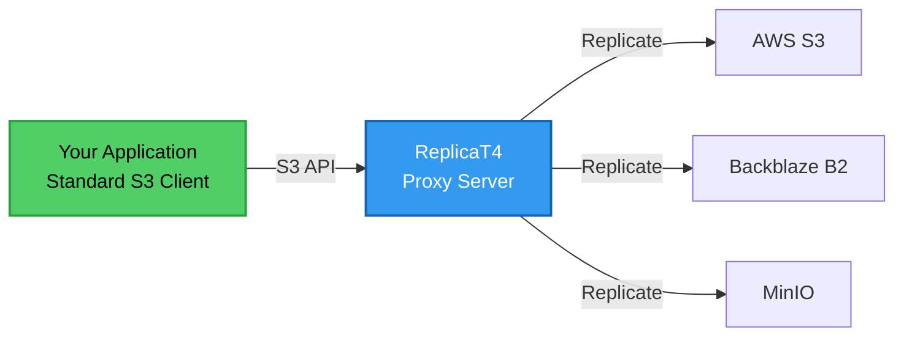

# ReplicaT4

An **S3-compatible proxy server that intercepts and replicates object storage operations across multiple
backends** simultaneously. Supports any S3-compatible storage (AWS S3, MinIO, Backblaze B2, etc.) as
replication targets.

ReplicaT4 sits transparently between your applications and storage providers, enabling multi-cloud replication without modifying application code.



## Key Benefits

- **Zero Code Changes** - Your applications continue using standard S3 APIs
- **Provider Agnostic** - Mix and match any S3-compatible storage providers
- **Flexible Consistency** - Choose between fast async or strong sync replication
- **Cost Optimization** - Combine budget providers while maintaining multi-location durability
- **Vendor Independence** - Protect against provider-specific failures or lock-in

## Getting Started

<div class="grid cards" markdown>

-   :material-rocket-launch: **[Getting Started](getting-started.md)**

    ---

    Install ReplicaT4, create your configuration, and run your first replication in minutes.

-   :lucide-brain: **[Motivation](motivation.md)**

    ---

    Learn why ReplicaT4 exists and how it solves the durability vs. cost trade-off.

-   :material-cog: **[Configuration](configuration.md)**

    ---

    Complete reference for all configuration options and backend setup.

-   :material-swap-horizontal: **[Read/Write Modes](read-write-modes.md)**

    ---

    Understand replication strategies and choose the right mode for your use case.

-   :material-application-brackets: **[Usage Examples](usage-examples.md)**

    ---

    Common scenarios and real-world configurations for different requirements.

</div>

## Quick Example

```json title="config.json"
{
  "virtualBucket": "mybucket",
  "readMode": "PRIMARY_FALLBACK",
  "writeMode": "ASYNC_REPLICATION",
  "backends": [
    {
      "type": "s3",
      "name": "aws-primary",
      "region": "us-east-1",
      "bucket": "my-aws-bucket"
    },
    {
      "type": "s3",
      "name": "backblaze-backup",
      "region": "us-west-004",
      "bucket": "my-b2-bucket",
      "endpoint": "https://s3.us-west-004.backblazeb2.com"
    }
  ]
}
```

```bash
# Run with Docker
docker run -d -p 3000:3000 \
  -v $(pwd)/config.json:/app/config.json:ro \
  -e AWS_ACCESS_KEY_ID=MYKEY \
  -e AWS_SECRET_ACCESS_KEY=MYSECRET \
  ghcr.io/barreeeiroo/replicat4:latest

# Use with any S3-compatible tool
aws s3 cp myfile.txt s3://mybucket/ --endpoint-url http://localhost:3000
```

Data is now automatically replicated to both AWS S3 and Backblaze B2!
