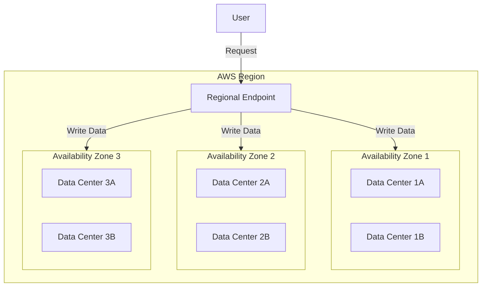

# Motivation

```mermaid
graph TB
    User[User]
    
    subgraph Region["AWS Region"]
        Endpoint[Regional Endpoint]
    
    subgraph AZ1["Availability Zone 1"]
        DC1A[Data Center 1A]
        DC1B[Data Center 1B]
    end
    
    subgraph AZ2["Availability Zone 2"]
        DC2A[Data Center 2A]
        DC2B[Data Center 2B]
    end
    
    subgraph AZ3["Availability Zone 3"]
        DC3A[Data Center 3A]
        DC3B[Data Center 3B]
    end
    end
    
    User -->|Request| Endpoint
    Endpoint -->|Write Data| AZ1
    Endpoint -->|Write Data| AZ2
    Endpoint -->|Write Data| AZ3
```
