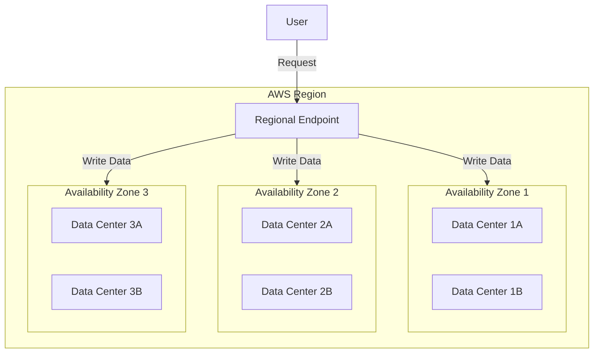
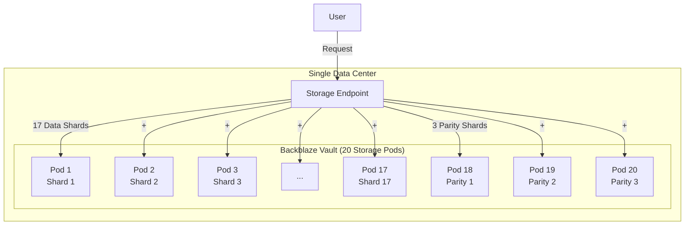
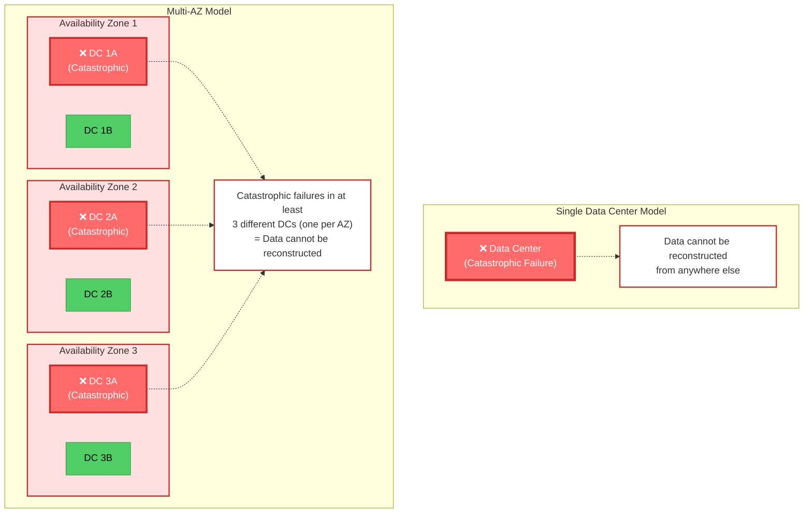

# Motivation

## The AWS S3 Durability Model

AWS S3 is renowned for providing 11 nines (99.999999999%) of durability. This impressive guarantee is achieved through
a robust architecture that also maintains **at least 3 copies of your data across different Availability Zones (AZs)**
within a region. Each AZ represents one or more physically separate data centers with independent power, cooling,
and networking.



This architecture ensures that if an entire data center experiences a catastrophic failure, your data remains safe and
accessible. For even greater protection, AWS also offers **cross-region replication**, allowing data to be replicated
across geographically distant regions.

## The Budget Provider Model

In contrast, budget-friendly S3-compatible providers like Backblaze B2 typically achieve durability through **erasure
coding within a single data center** rather than replicating complete copies across multiple physical locations.



For example, Backblaze's architecture uses **Reed-Solomon erasure coding** (17 data shards + 3 parity shards) to
achieve 11 nines durability[^3]. This means your file is split into 17 pieces, with 3 additional parity pieces
calculated from the original data. The file can be reconstructed from any 17 of the 20 shards, allowing the system to
tolerate up to 3 simultaneous drive/pod failures.

While this provides excellent protection against individual hardware failures, all shards exist within a **single
physical location**. If the entire data center experiences a catastrophic event, all 20 shards could be lost
simultaneously.

## The Cost vs. Durability Trade-off

While AWS S3 provides exceptional durability, it comes at a premium price. Many S3-compatible storage providers have
emerged offering significantly cheaper alternatives:

- [**Backblaze B2**](https://www.backblaze.com/cloud-storage)
- [**Cloudflare R2**](https://www.cloudflare.com/developer-platform/products/r2/)
- [**Hetzner Object Storage**](https://www.hetzner.com/storage/object-storage/)
- [**OVH Object Storage**](https://www.ovhcloud.com/en-ie/public-cloud/object-storage/)
- [**MinIO**](https://www.min.io/) (allows self-hosting)
- And many others

These providers are often **considerably more affordable** than AWS S3. However, this cost savings comes with a
trade-off: **reduced protection against data center-level failures**.

### Single-Location Storage

As shown in the Backblaze example above, budget-friendly S3-compatible providers typically use **erasure coding or
RAID within a single data center** rather than maintaining complete copies across multiple physical locations. While
this provides excellent protection against individual hardware failures, all data remains in one geographic location.

### What It Takes to Lose Data

A **catastrophic failure** means damage severe enough that the stored object data cannot be reconstructed. The
difference in disaster resilience becomes clear when comparing what must fail for permanent data loss to occur:

- **Single Data Center**: If that one DC suffers catastrophic failure, your data is gone
- **Multi-AZ Architecture**: Requires catastrophic failures across **at least 3 different data centers** (affecting
  all 3 AZs) for data loss to occur



With **single-location storage**, a catastrophic failure of one data center means total data loss—there's nowhere else
to reconstruct from. With **multi-AZ architecture**, your data remains safe even if an entire AZ is destroyed, and
requires the highly unlikely scenario of simultaneous catastrophic failures across at least 3 different data centers
in geographically separated locations before data becomes unrecoverable.

!!! danger "Risk of Data Loss"
    If the data center hosting your data experiences a catastrophic failure (fire, flood, power loss, etc.), you could
    face **permanent data loss**. Unlike AWS S3's multi-AZ architecture, there are no additional copies in separate
    physical locations to fall back on.

    This is not a theoretical risk: in March 2021, a fire at an OVH data center in Strasbourg destroyed servers and
    resulted in permanent data loss for customers who did not have off-site backups[^1] [^2].

## Limitations of Native Replication

Some S3-compatible providers do offer native replication features. For example, **Backblaze B2** provides bucket
replication[^4]. However, these solutions have significant limitations:

### Async-Only Replication

Native replication is typically **asynchronous**, meaning there's a delay between when data is written to the primary
location and when it appears in replicas, which may be up to several hours[^4]. During this window, you're vulnerable
to data loss if the primary fails.

### Single-Cloud Restriction

Native replication features are **confined to the same cloud provider**. For example, Backblaze can only replicate to
other Backblaze buckets[^4]. You cannot replicate from Backblaze to MinIO, or from Hetzner to OVH.

### No Cross-Cloud Disaster Recovery

If you want to protect against a provider-level failure (e.g., provider goes out of business, widespread service
outage, compliance issues), native replication cannot help you because all copies remain with the same vendor.

## The Need for Manual Replication

To achieve AWS-like durability with budget storage providers, you need to **manually implement replication as a backup
strategy**. This increases your effective durability by maintaining copies across multiple independent storage
locations or providers.

### Option 1: Dual Writes in Your Application

You can implement replication directly in your application code:

```python
# Pseudocode
def upload_file(file, key):
    s3_client_primary.put_object(bucket='primary', key=key, body=file)
    s3_client_backup.put_object(bucket='backup', key=key, body=file)
```

**Drawbacks:**

- Requires modifying application code
- Must be implemented consistently across all applications
- Increases application complexity
- Difficult to change replication strategies
- Error handling becomes complicated

### Option 2: Use a Transparent Proxy (ReplicaT4)

ReplicaT4 acts as a proxy layer between your application and storage backends:

```python
# No code changes needed!
s3_client = boto3.client('s3', endpoint_url='http://replicat4:3000')
s3_client.put_object(bucket='my-bucket', key=key, body=file)
# ReplicaT4 automatically replicates to all configured backends
```

**Benefits:**

- **Zero application code changes**: your apps continue using standard S3 APIs
- **Centralized replication logic**: change strategies without touching application code
- **Consistent replication** across all applications automatically
- **Flexible consistency models**: choose between async (fast) and sync (consistent) replication
- **Mix and match providers**: combine different storage backends seamlessly

## Why ReplicaT4?

ReplicaT4 solves these challenges by providing:

- **Provider-agnostic replication**: works with any S3-compatible storage
- **Cross-cloud capability**: replicate across different providers (Backblaze → MinIO → Hetzner)
- **Flexible consistency models**: choose async for speed or sync for strong consistency
- **Application transparency**: no code changes required
- **Unified control**: manage all replication from a single configuration

Whether you're using budget providers to reduce costs or implementing a defense-in-depth strategy against vendor
lock-in, ReplicaT4 enables you to achieve the durability you need without sacrificing flexibility or breaking the bank.


[^1]: [Reddit Discussion: Did OVH customers lose data that shouldn't have been lost?](https://www.reddit.com/r/webhosting/comments/m8e5so/eli5_did_ovh_customers_lose_data_that_shouldnt/)
[^2]: [Techzine: OVH shares overview of data lost in fire](https://www.techzine.eu/news/infrastructure/57005/ovh-share-overview-of-data-lost-in-fire/)
[^3]: [Backblaze Vaults: Zettabyte-Scale Cloud Storage Architecture](https://www.backblaze.com/blog/vault-cloud-storage-architecture/)
[^4]: [Backblaze B2 Cloud Replication](https://www.backblaze.com/docs/cloud-storage-cloud-replication)
