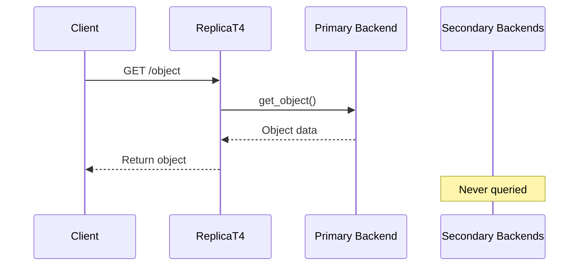
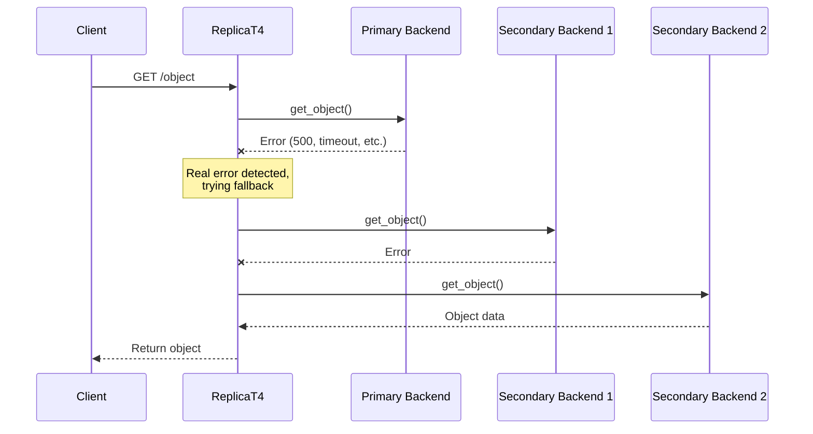
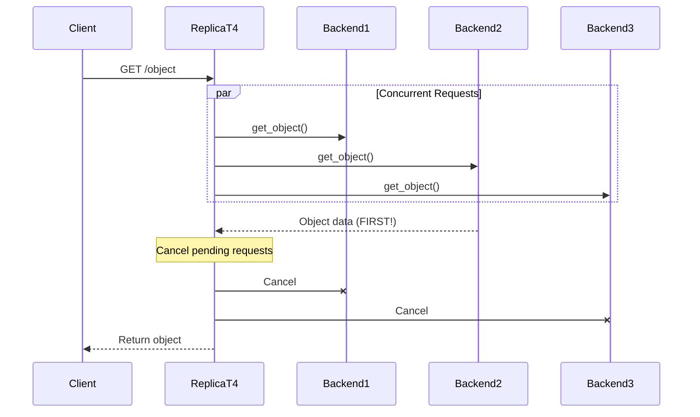
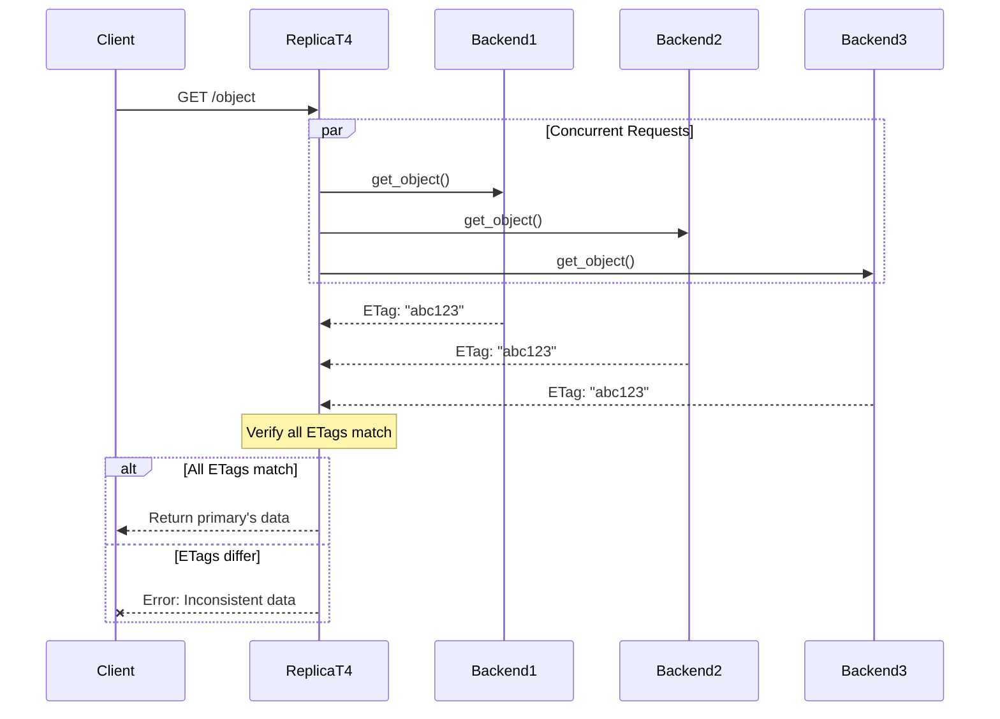
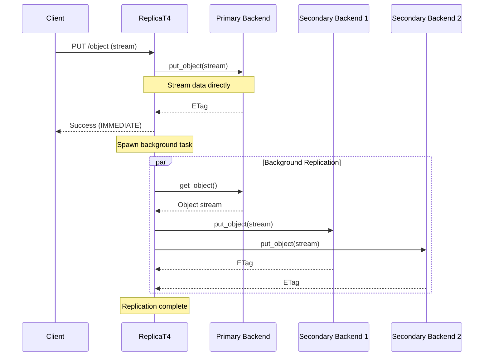
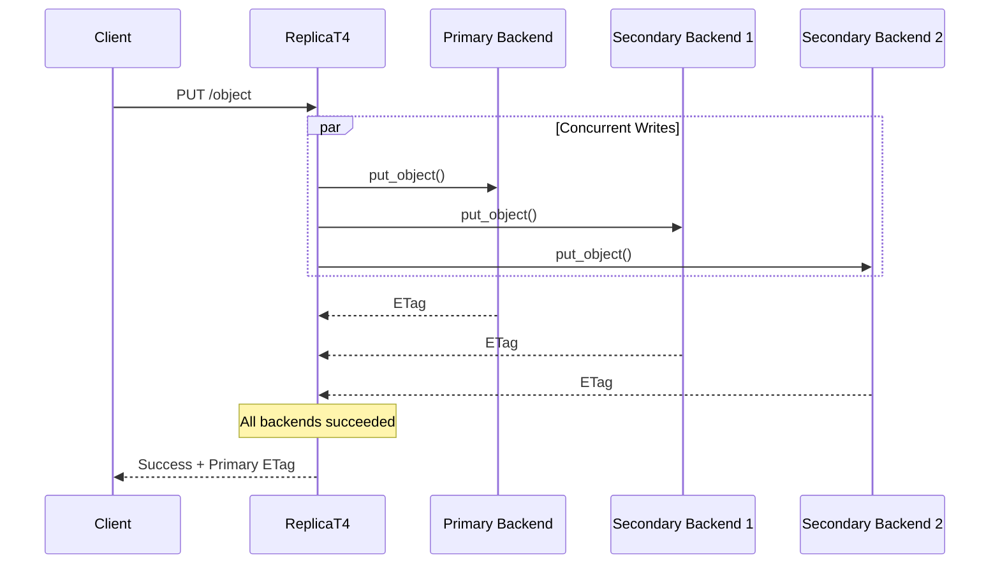

# Read/Write Modes

ReplicaT4 provides flexible strategies for reading and writing data across multiple storage backends. These modes allow
you to optimize for different requirements: **speed**, **consistency**, or **fault tolerance**.

## Overview

ReplicaT4 supports:

- **4 Read Modes**: `PRIMARY_ONLY`, `PRIMARY_FALLBACK`, `BEST_EFFORT`, `ALL_CONSISTENT`
- **2 Write Modes**: `ASYNC_REPLICATION`, `MULTI_SYNC`

## Read Modes

Read modes determine how ReplicaT4 fetches data from your configured backends when handling GET, HEAD, and LIST
requests.

| Mode                 | Latency           | Fault Tolerance | Consistency     | Backend Load | Best For                            |
|----------------------|-------------------|-----------------|-----------------|--------------|-------------------------------------|
| **PRIMARY_ONLY**     | Fastest           | None            | Primary's state | Minimal      | High-performance, reliable primary  |
| **PRIMARY_FALLBACK** | Fast              | High            | Primary's state | Low          | General purpose, balanced           |
| **BEST_EFFORT**      | Variable (lowest) | Highest         | Eventual        | High         | Geo-distributed, low latency        |
| **ALL_CONSISTENT**   | Slowest           | None            | Strong          | High         | Critical data, corruption detection |

### `PRIMARY_ONLY`

**Use Case**: Maximum speed when the primary backend is highly reliable.

**Behavior**: All read requests are served exclusively from the primary backend. No fallback to other backends occurs.

**When to Use**:

- Primary backend has high availability guarantees
- Speed is the top priority
- Acceptable to fail requests if primary is down

### `PRIMARY_FALLBACK`

**Use Case**: Balanced approach with fast reads and resilience to backend failures.

**Behavior**: Attempts to read from the primary backend first. If the primary returns a **real error** (not "object
not found"), ReplicaT4 sequentially tries other backends as fallbacks.

**When to Use**:

- Primary backend is usually fast but may occasionally fail
- Need fault tolerance without the overhead of querying all backends
- Default recommended mode for most use cases

### `BEST_EFFORT`

**Use Case**: Minimize latency across geographically distributed backends.

**Behavior**: Sends concurrent requests to **all backends simultaneously** and returns the first successful response.
Other pending requests are cancelled.

**When to Use**:

- Backends are geographically distributed
- Minimizing latency is critical
- Eventual consistency is acceptable
- Backends have excess capacity to handle additional requests

### ALL_CONSISTENT

**Use Case**: Strong consistency guarantees and corruption detection.

**Behavior**: Queries **all backends concurrently**, waits for all responses, and verifies that all backends return
the same data (by comparing ETags). Returns an error if any backend fails or if data is inconsistent.

**When to Use**:

- Data integrity is critical
- Need to detect and alert on replication failures
- All backends must be available
- Compliance or audit requirements

## Write Modes

Write modes determine how ReplicaT4 replicates data across backends when handling PUT and DELETE requests.

| Mode                  | Client Latency      | Consistency Model | Failure Handling            | Best For                 |
|-----------------------|---------------------|-------------------|-----------------------------|--------------------------|
| **ASYNC_REPLICATION** | Fast (primary only) | Eventual          | Secondary failures logged   | High-performance writes  |
| **MULTI_SYNC**        | Slow (all backends) | Strong            | Any failure fails operation | Critical data durability |

### `ASYNC_REPLICATION`

**Use Case**: Fast writes with eventual consistency.

**Behavior**:
1. Write data to the **primary backend** only
2. Return success to the client immediately after primary write completes
3. Asynchronously replicate to other backends in the background

**When to Use**:

- Write performance is critical
- Eventual consistency is acceptable
- Primary backend is reliable
- Can tolerate temporary replication lag

### `MULTI_SYNC`

**Use Case**: Strong consistency with guaranteed multi-backend durability.

**Behavior**: Writes to **all backends concurrently** and waits for all writes to complete successfully before
returning to the client. If any backend fails, the entire operation fails.

**When to Use**:

- Data must be durably stored on all backends
- Strong consistency is required
- All backends are reliable and performant
- Compliance or regulatory requirements

## Error Handling

### Read Errors

**`PRIMARY_FALLBACK`**:

- `NoSuchKey` / `NoSuchBucket` → No fallback, return error immediately
- Other errors (timeout, 500, etc.) → Try fallback backends sequentially

**`BEST_EFFORT`**:

- Returns first successful response
- Ignores errors from slower backends

**`ALL_CONSISTENT`**:

- Any backend error → Fail entire operation
- ETag mismatch → Fail entire operation

### Write Errors

**`ASYNC_REPLICATION`**:

- Primary failure → Return error to client
- Secondary failures → Logged, operation succeeds

**`MULTI_SYNC`**:

- Any backend failure → Fail entire operation
